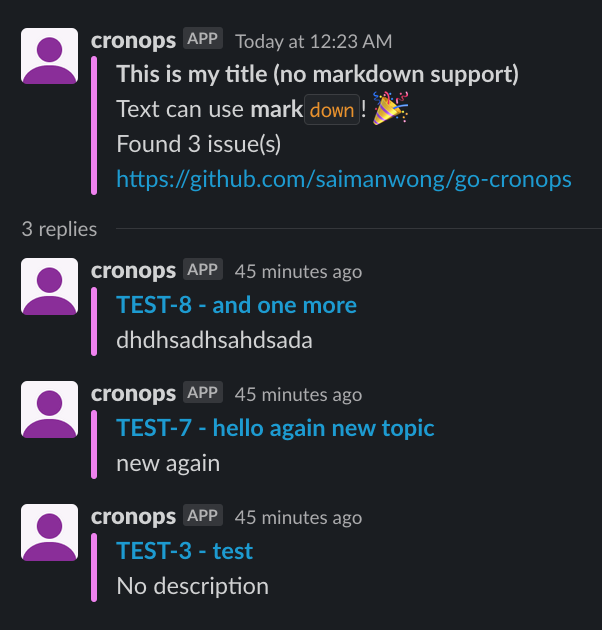

# JiraSlack plugin

This plugin uses Jira Query Language (JQL) to search for issues and posts them to Slack.

## Example

### Config

See [`configs/config.yml`](../../../configs/config.yml) for example config.

### Screenshots

